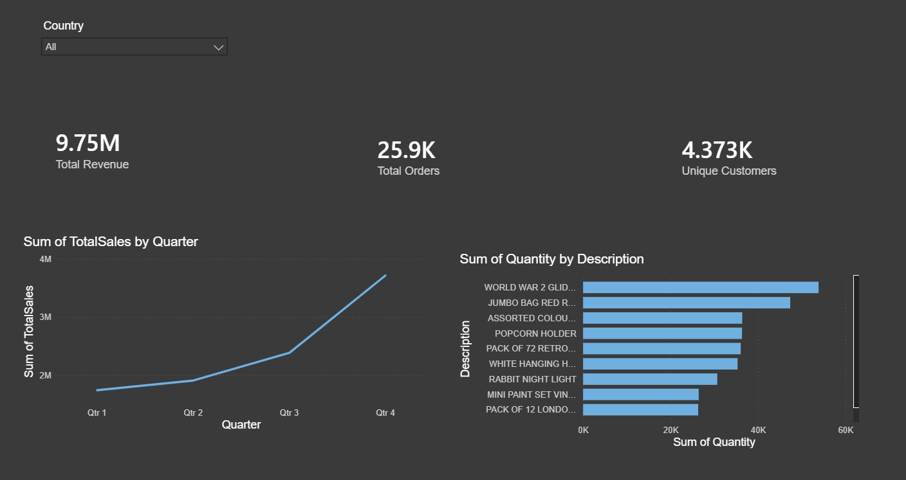

# E-Commerce Data Analytics & Business Intelligence Dashboard

##  Project Overview
This project solves a classic retail business challenge: transforming raw, unorganized e-commerce transaction logs into structured datasets and interactive business insights. 

By building an end-to-end analytics pipeline, this project helps executive stakeholders monitor global sales health, track monthly performance trends, and identify high-value customer segments to optimize marketing spend.

##  Tech Stack
**Data Cleaning & Engineering:** Python (Pandas)
**Relational Database Storage:** MySQL
**Analytics Queries:** SQL (CTEs, Window Functions)
**Business Intelligence & Visualization:** Power BI

##  Live Dashboard Preview

## Repository Structure
├── data/
│   └── dataset_link.txt         # Link to the original Kaggle source data
├── notebooks/
│   └── data_cleaning.ipynb      # Python data wrangling, handling missing values & feature engineering
├── sql/
│   └── analytics_queries.sql    # Complex MySQL metrics (Monthly Revenue CTE & Customer Lifetime Value)
├── dashboard/
│   ├── ecommerce_dashboard.pbix # Complete downloadable Power BI file
│   └── dashboard_screenshot.png # High-res dashboard visual for quick viewing
└── README.md                    # Project documentation and business case study

##  Key Business Insights
**Seasonality Trends:** Global retail sales peaked aggressively during November, indicating a strong holiday shopping rush. This insight allows inventory managers to scale stock levels prior to Q4.
**Pareto Principle in Action:** Approximately 10% of unique customers contribute to over 60% of total revenue. Identifying these high-value segments allows growth teams to build dedicated loyalty programs.
**Geographic Concentrates:** The United Kingdom represents the primary market share, while emerging markets show high average unit prices despite lower order volumes.

##  How to Run This Project
1. Clone this repository to your machine.
2. Run `notebooks/data_cleaning.ipynb` to process the raw data source.
3. Execute the scripts in `sql/analytics_queries.sql` within your local MySQL client to generate the relational analytics tables.
4. Open `dashboard/ecommerce_dashboard.pbix` in Power BI Desktop to interact with the live charts.